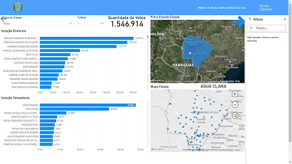
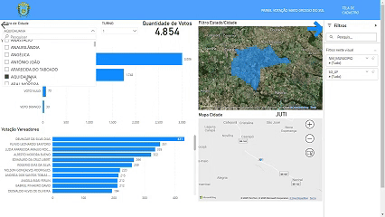
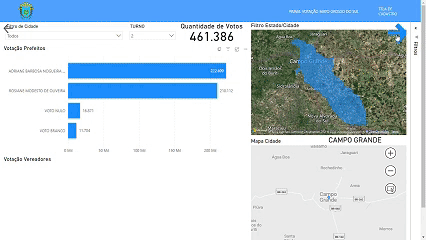
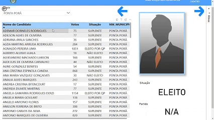

## Welcome again to a PowerBI + React project! 👋

## Test the project yourself: [Teste the project here!!!](#)

#### Using maps to filter data

#### Page 1 - Columns:

#### Page 1 - Columns - Part 2:

#### Page 2 - Pie chart:

#### Page 3 and 4 - Using names to render picure and their data:

## Built with

- [`React+Vite`](https://vite.dev/);
- [`PowerBI`](https://www.microsoft.com/en/power-platform/products/power-bi?market=af)
- [`Tailwind`](https://tailwindcss.com/)

## Author

- Website - [My GitHub](https://github.com/lucasbailo)
- Frontend Mentor - [@lucasbailo](https://www.frontendmentor.io/profile/lucasbailo)
- Instagram - [@lucassbailo](https://www.instagram.com/lucassbailo/)
- LinkedIn - [Lucas Bailo](https://www.linkedin.com/in/lcsbailo)

# React + Vite

This template provides a minimal setup to get React working in Vite with HMR and some ESLint rules.

Currently, two official plugins are available:

- [@vitejs/plugin-react](https://github.com/vitejs/vite-plugin-react/blob/main/packages/plugin-react/README.md) uses [Babel](https://babeljs.io/) for Fast Refresh
- [@vitejs/plugin-react-swc](https://github.com/vitejs/vite-plugin-react-swc) uses [SWC](https://swc.rs/) for Fast Refresh

## Expanding the ESLint configuration

If you are developing a production application, we recommend using TypeScript and enable type-aware lint rules. Check out the [TS template](https://github.com/vitejs/vite/tree/main/packages/create-vite/template-react-ts) to integrate TypeScript and [`typescript-eslint`](https://typescript-eslint.io) in your project.
